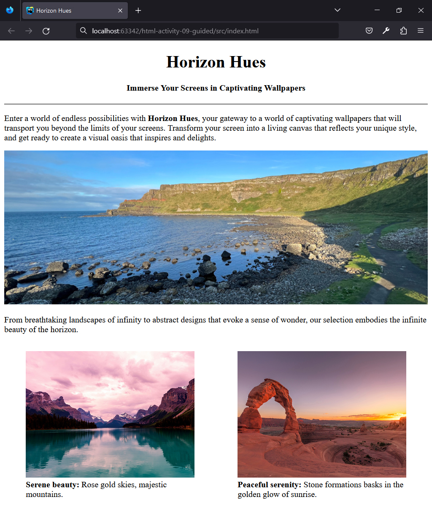
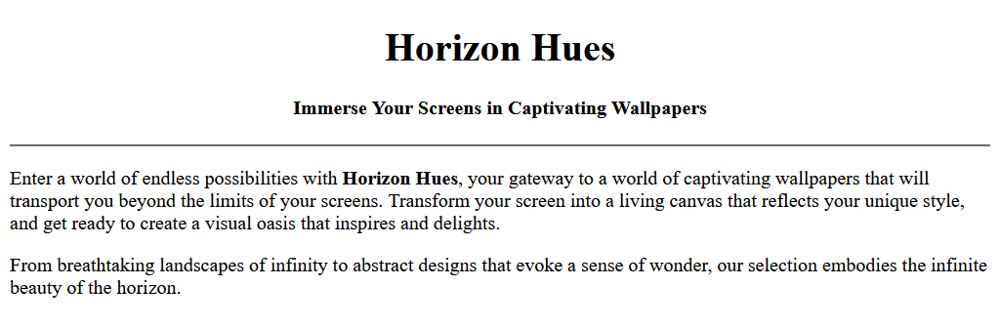
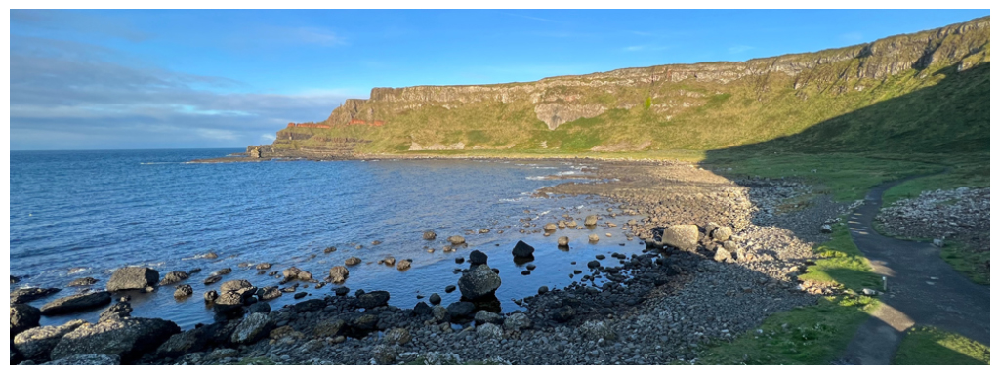
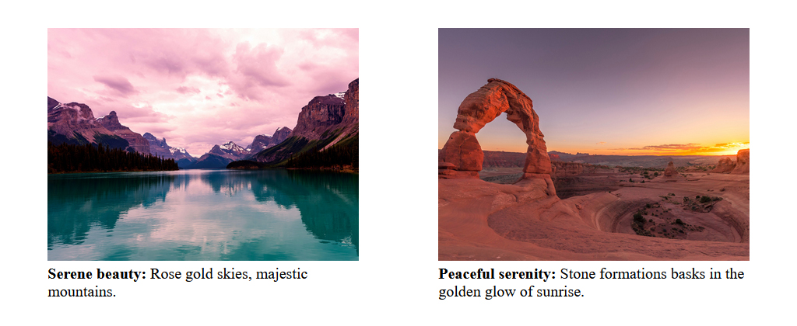

## HTML | Activity #9 (Guided): Images (Picture and Figure)
In this activity, we will create a **Wallpapers Page** with the following content:




### Development Setup
Create your `index.html` file inside the [**src**](/src) folder in this project,
then follow along with this guide.

To test your output, simply open it in your preferred web browser.


### Template
First, we need a regular HTML template that already contains the headers and paragraphs.



We will leave [comments](https://www.w3schools.com/html/html_comments.asp) for the parts that we will do later.

```html
<!DOCTYPE html>
<html lang="en">
<head>
    <meta charset="UTF-8">
    <title>Horizon Hues</title>
</head>
<body>
    <div class="intro">
        <div align="center">
            <h1>Horizon Hues</h1>
            <h4>Immerse Your Screens in Captivating Wallpapers</h4>
            <hr/>
        </div>
        <p>
            Enter a world of endless possibilities with <b>Horizon Hues</b>,
            your gateway to a world of captivating wallpapers
            that will transport you beyond the limits of your screens.
            Transform your screen into a living canvas that reflects your unique style,
            and get ready to create a visual oasis that inspires and delights.
        </p>
    </div>

    <div class="cover">

        <!-- Cover Image -->
        
    </div>

    <div class="wallpapers">
        <p>
            From breathtaking landscapes of infinity
            to abstract designs that evoke a sense of wonder,
            our selection embodies the infinite beauty of the horizon.
        </p>

        <table width="100%" cellspacing="0">
            <tr>
                <td width="50%">

                    <!-- Wallpaper 1 -->

                </td>
                <td width="50%">

                    <!-- Wallpaper 2 -->

                </td>
            </tr>
        </table>
    </div>
</body>
</html>
```


### Cover Image
The default **Cover Image** is
[**img/cover.jpg**](/src/img/cover.jpg).
It measures ***1366px by 384px***
(**px** stands for [**"pixel"**](https://www.techopedia.com/definition/24012/pixel)).



To ensure visibility of key image details,
our goal is to present varying versions of our Cover Image
based on the maximum width of the screen.

| Screen Max Width | Cover Image                                             |
|:----------------:|---------------------------------------------------------|
|    **320px**     | [**img/cover-320x240.jpg**](/src/img/cover-320x240.jpg) |
|    **480px**     | [**img/cover-480x320.jpg**](/src/img/cover-480x320.jpg) |
|    **768px**     | [**img/cover-768x280.jpg**](/src/img/cover-768x280.jpg) |
|    **768px**     | [**img/cover-992x360.jpg**](/src/img/cover-992x360.jpg) |
|     Default      | [**img/cover.jpg**](/src/img/cover.jpg)                 |

To specify multiple sources for an image element,
we will use the `<picture>` tag.

```html
        ...
        
        <!-- Cover Image -->
        <picture>
            <source media="(max-width: 320px)" srcset="img/cover-320x240.jpg"/>
            <source media="(max-width: 480px)" srcset="img/cover-480x320.jpg"/>
            <source media="(max-width: 768px)" srcset="img/cover-768x280.jpg"/>
            <source media="(max-width: 992px)" srcset="img/cover-992x360.jpg"/>
            
        </picture>
        
        ...
```

Each `<source/>` inside the `<picture>` tag  defines an image source.
Its `media` attribute sets the **condition** for using that source,
while the `srcset` attribute points to the **image file path** or **URL**.
The fallback or default image source must be defined at the end.

After implementing the code, test the output in your web browser.
Resize your browser window to see if it works correctly. 


### Wallpapers
Each individual **Wallpaper** shows an image and its caption.



In this section, we will use the `<figure>` tag
to group together the image with its caption in the `<figcaption>` tag.

```html
                    ...
                    
                    <!-- Wallpaper 1 -->
                    <figure>
                        
                        <figcaption>
                            <b>Serene beauty:</b>
                            Rose gold skies, majestic mountains.
                        </figcaption>
                    </figure>
                    
                    ...
```

***TODO***: Please finish this **Wallpapers Page**
by defining the captioned wallpaper on the right.
